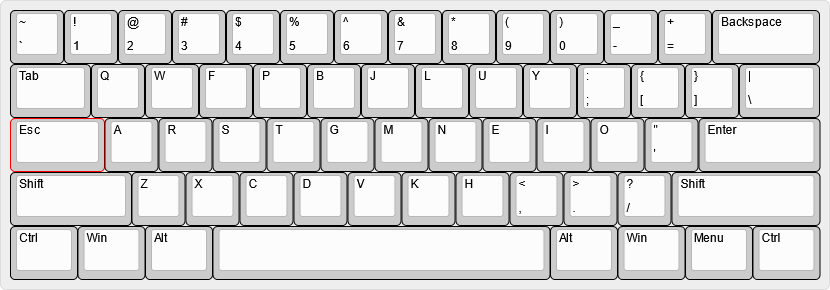

# My Keyboard Configs

I've gotten too used to a modified version of [Colemak Mod-DH](https://colemakmods.github.io/mod-dh/) to the point where I need it anywhere I have to work seriously.

## About the Layout

I use [Colemak Mod-DH](https://colemakmods.github.io/mod-dh/) without the [angle mod](https://colemakmods.github.io/mod-dh/#angle-mod). I also swap the Escape and Caps Lock keys:

## AutoHotkey

If you have AutoHotkey installed, you can simply grab the script in the source code.

If you wish to use it without installing AutoHotkey, you'll have to compile it to a standalone executable first. Instructions for doing so are available in the [AutoHotkey documentation](https://www.autohotkey.com/docs/Scripts.htm#ahk2exe).

A pre-compiled version of this script is available on the [releases page](https://github.com/ChuseCubr/keyboard-config).

## Lily58 Firmware

I tried to play around with custom Vial firmware to get what I want out of my custom keyboard.

The compiled firmware is available on the [releases page](https://github.com/ChuseCubr/keyboard-config)

For more info on building, check out the [Vial guide](https://get.vial.today/docs/porting-to-vial.html)

## Lily58 Layout

This uses [Mini-ryoku](https://github.com/ChuseCubr/mini-ryoku), my 34-key layout based on [Miryoku](https://github.com/manna-harbour/miryoku), with gaming layers.
